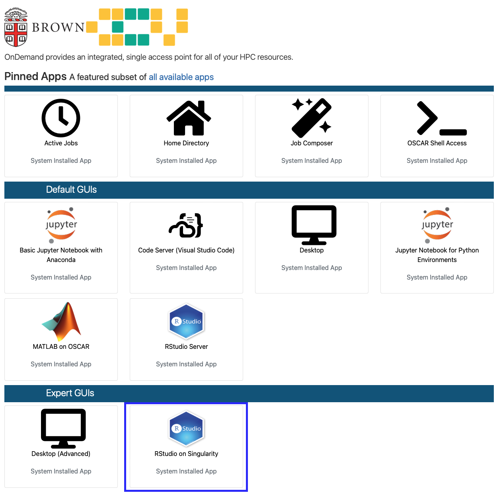
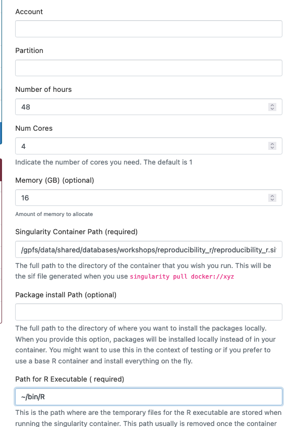
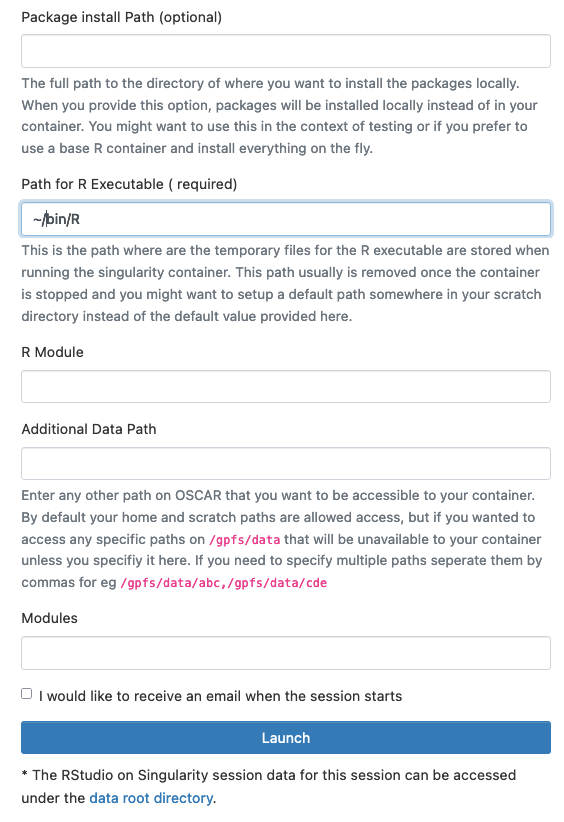
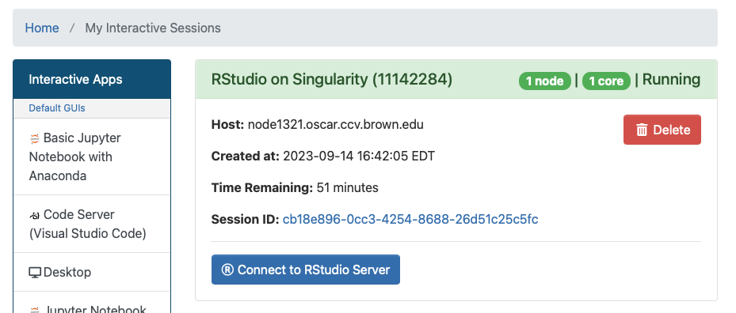
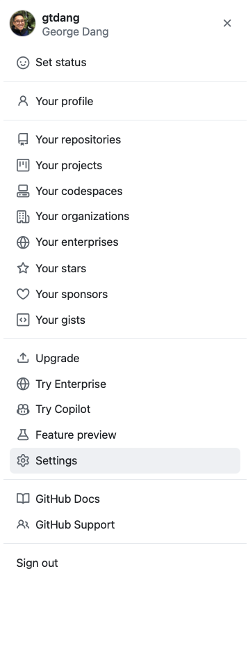
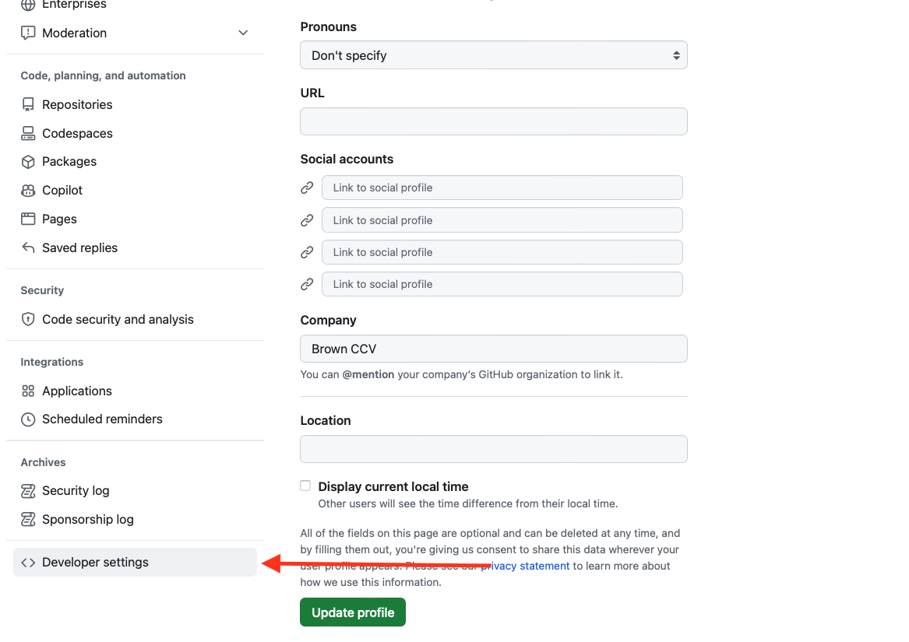
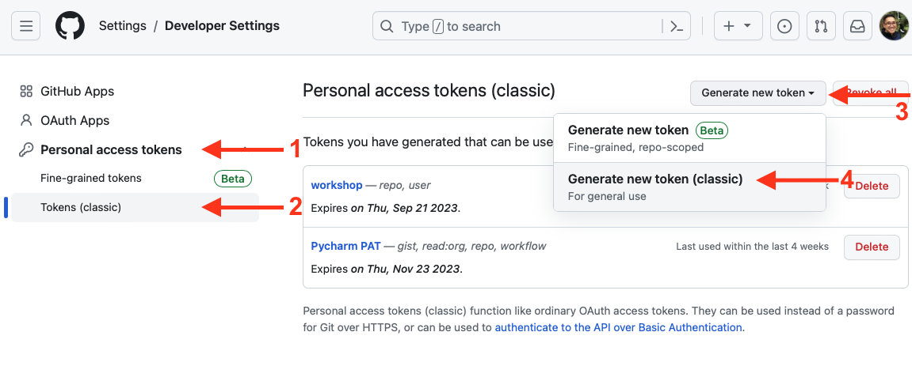
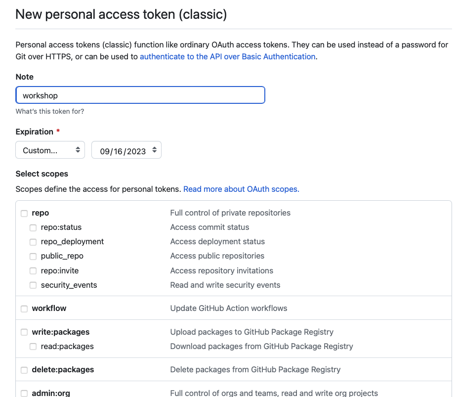
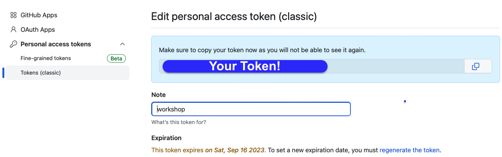

# Reproducible Research
In this workshop we will be covering best practices for **Reproducible Research**. This workshop 
will have two interactive components 1) How to PR Git session and 2) Coding best practices with R.
We will be working within a containerized RStudio environment using Brown's HPC cluster, OSCAR. For 
this workshop you will need both a GitHub and OSCAR account!

[Link for OSCAR sign-up](https://brown.co1.qualtrics.com/jfe/form/SV_0GtBE8kWJpmeG4B)

[Link for GitHub sign-up](https://github.com/)

[Presentation Slides](https://docs.google.com/presentation/d/1n-tNWJCbu9Z4Jo1J4wJcVAjtIBnsXP65MQytkvud0KI/edit?usp=sharing)

## I. Launching RStudio on Singularity with OOD

1. Go to [ood.ccv.brown.edu](ood.ccv.brown.edu) and log in with your credentials.
2. On the landing page select the **RStudio on Singularity** app. 
3. Fill in the following fields and leave the other fields empty
   - Number of Hours: 48
   - Num Cores: 4
   - Memory: 16
   - Singularity Container Path: `/gpfs/data/shared/databases/workshops/reproducibility_r/reproducibility_r.sif`
   - Path for R Executable: `~/bin/R`
   - 
It should look like the two images below.

4. Select Launch. The session will now be queued. You will be brought to your interactive sessions dashboard. 
5. When the session is ready a **Connect to RStudio Server** button will appear (see image below). Click this button to launch your instance.

## II. Authenticating GitHub while using a containerized instance
You will need to authenticate your GitHub credentials to make branches and push commits to the remote repository. 
This is a bit tricky because you are working within a container instance, which does not have access to 
more seamless authentication methods. 

For this workshop you will be manually submitting your credentials 
with your GitHub *username* and *authentication token*. The benefit of using a token is that it is more secure
than entering your password and the token can be set to expire. 

Below are steps on how to generate a token for this workshop. 
1. Logged into GitHub, click your user icon at the top right of the page to open the pop-out menu bar.
Select `Settings` 

2. In the next page select `Developer settings` at the very bottom of the left-screen menu.

3. Select `Personal access tokens`>`Tokens (classic)`>`Generate new token` > `Generate new token (classic)`

4. Make a name for your token under *Note* and set a custom expiration for tomorrow. At the bottom 
of the page select the `Generate` button.

5. Your token will appear at the top of the page. Leave this page open for you to copy and paste your token 
during this workshop. If you accidentally close the tab you can navigate back to 
`Developer settings`>`Personal access tokens`>`Tokens (classic)`, select your token name and regenerate
a new code to use. 

